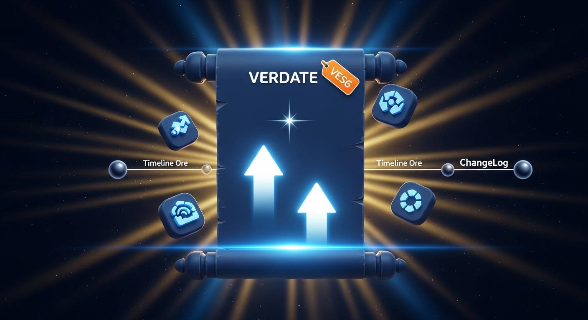

# New Haven Gaming Bot — Changelog

---

## v1.9.0 — March 26, 2026

### Private Bot Message Updated

When someone adds the bot to an unauthorized server, the bot now sends a clearer DM to the server owner before leaving:

- Updated message text to be friendlier and more direct
- Includes a clickable link to the [Haven Gaming Server](https://discord.gg/QRy4vFh9R5) so owners know where to reach out
- Footer notes that highlighted text is a hyperlink and can be clicked or tapped
- Fixed a bug where both bot instances would send the DM — now only one message is sent per unauthorized join

---

## v1.8.0 — March 25, 2026

### Full Database Migration (Neon PostgreSQL)

All tracking systems have been migrated from local JSON files to a hosted PostgreSQL database on Neon. This means data now persists reliably across restarts, deployments, and is never at risk of being lost or overwritten.

**What moved to the database:**

| System | What's stored |
|---|---|
| Message tracking | Total and weekly message counts per user |
| Invite tracking | Invite counts per user |
| Voice time | Total and weekly voice time per user |

All operations use atomic SQL so counts can never get out of sync even if two things happen at once.

### Event Deduplication System

A deduplication layer was added across all event-driven actions. When two bot instances are running simultaneously, each event (message counted, reminder fired, welcome sent, unauthorized join handled) is now claimed by exactly one instance — the other silently skips it. This eliminates all duplicate actions without requiring one bot to be manually stopped.

**Covered events:**

- Message counts (each message ID is claimed once)
- Reminders (each reminder fires exactly once at the correct time)
- Welcome messages (new member join handled by one instance)
- Unauthorized server joins (private bot DM sent once)

### Reminder Reliability Fix

Daily, weekly, and monthly reminders (`/daily`, `/weekly`, `/monthly`) now properly save to the database before the command response is sent. Previously, a bot restart between the command being run and the reminder firing could silently drop the reminder entirely.

---

## v1.7.0 — March 22, 2026

### Welcome System

New members are now greeted with a two-message welcome sequence when they join:

1. **GIF + ping** — the bot pings the `@Welcomer` role and posts the animated welcome GIF directly under the ping
2. **Welcome embed** — a styled embed with the new member's username and avatar, a **Getting Started** section linking to Rules, Channels & Roles, Browse Channels, and Information, and a footer showing their member number (e.g. "You are the 74th member, Enjoy!")

Fixed a bug where the welcome message was sent twice — caused by both the dev and production bots running simultaneously. The dev bot now stays stopped while the production bot is live.

---

## v1.6.0 — March 22, 2026

### Level & XP System

A full XP and level system has been added. Every message you send earns you XP, and the bot tracks your level based on total XP earned.

**How it works:**
- Each message grants **15–25 XP** (random) with a **60-second cooldown** — one grant per minute per user, preventing spam farming
- **Server Boosters** earn a **+15% XP bonus** on every message, shown with the <:boosters:1481418598059737118> emoji
- Level formula: `level = floor(sqrt(xp / 100))` — XP required scales quadratically so each level takes more effort
- When you level up, the bot announces it in the channel you were chatting in

**New commands:**
- `/rank [user]` — shows your rank on the server, level, total XP, and a visual progress bar to the next level
- `/lbrank` — top 10 XP leaderboard with medals for the top 3

**Profile updated:**
- `/profile` now shows a **Level & XP** section at the top with your level, XP, progress bar, and booster badge

**Existing members:** All members with message history had their XP seeded automatically at 20 XP per message so nobody started from zero.

---

## v1.5.0 — March 22, 2026

### Rob System Overhaul

**Penalty now pulls from wallet first, then bank:**
When a rob fails, the penalty used to always come from your wallet — if your wallet was empty you paid nothing. Now the penalty pulls from your wallet first, and if your wallet doesn't cover the full amount, the remainder is automatically pulled from your bank.

**Embed field renamed:**
The "Victim's Payout" field in the rob failure embed has been renamed to **Paid to Victim** and now shows the penalty amount you paid — not the victim's new wallet balance.

**Rob stats moved to PostgreSQL:**
Rob statistics (wins, losses, coins stolen, coins lost, times robbed) are now stored in the database instead of a JSON file. Stats persist properly across bot restarts and deployments.

**`/roblb` updated:**
The robbery leaderboard now shows each robber's **win/loss record** and **success rate** alongside their stats, and the Most Robbed section shows victims by number of times robbed.

---

## v1.4.0 — March 22, 2026

### Leaderboard Command Renames

All leaderboard subcommands have been promoted to standalone top-level commands for easier access:

| Old Command | New Command |
|---|---|
| `/leaderboard` | `/lbeconomy` |
| `/invites leaderboard` | `/lbinvite` |
| `/messages leaderboard` | `/lbmsg` |
| `/voicetime leaderboard` | `/lbvc` |

The old subcommand format no longer works — use the new standalone commands.

---

## Session — March 21, 2026

### `/highlow` — Stateless Game (Bot-Restart Proof)

The High or Low game no longer stores active games in bot memory. The shown number and the player's user ID are now encoded directly into each button's ID, so the game survives bot restarts and deployments without any state loss. As a side effect, the game's buttons now only respond to the member who started it — other members cannot click your game.

---

### `/balance` — Removed User Lookup

`/balance` no longer accepts a `@user` option. It now only shows your own wallet, bank, and total. Members who want to check someone else's wallet can use `/spy` (requires a Spy item from the shop).

---

### Shop Management — Restricted to Bot Owner

`/shopedit` and `/shopremove` were previously gated on **Manage Guild** permission. Both are now restricted to the **bot owner only**, matching `/shopadd`. Only the bot owner can add, edit, or remove shop items.

---

### Owner-Only Check Hardened Across All Commands

All bot-owner-restricted commands (`/coins`, `/addvoicetime`, `/shopadd`, `/shopedit`, `/shopremove`) previously used a live Discord API call to look up the application owner at runtime — which could silently fail. All five commands now use a hardcoded owner ID check that is instant and always reliable.

---

## Session — March 20, 2026 (continued)

### Shop Price Adjustments

Rebalanced the robbery shop items for better economy fairness:

| Item | Old Price | New Price |
|---|---|---|
| Rob Shield | 🪙 500 | 🪙 500 (unchanged) |
| Lockpick | 🪙 200 | 🪙 600 |
| Spy | 🪙 400 | 🪙 250 |

The Lockpick price was raised so bypassing a Rob Shield costs at least as much as placing one. The Spy price was lowered to encourage use — checking a wallet is useful info but not powerful enough to justify a near-daily cost.

---

### `/roleadd` — Multi-Role & All Members Support

`/roleadd` has been expanded significantly:

- **Up to 5 roles at once** — `role1` through `role5` (role1 is required, the rest are optional). All roles are validated against bot and caller hierarchy before any are applied.
- **All members** — set `all_members: True` to apply every selected role to the entire server. The bot fetches all members, skips anyone who already has all the roles, and posts a summary embed showing how many were updated, skipped, and failed.
- **Bulk summary embed** — when applying to all members, the reply shows updated / skipped / failed counts instead of a per-member breakdown.

---

### `/post` — Management Footer

All three post types (`/post update`, `/post announce`, `/post botupdates`) now show a fixed footer on every embed:

- **Icon** — the avatar of whoever ran the command
- **Text** — `Management: {their server display name}`

The optional footer text field has been removed from the modal — the footer is now set automatically. The modal now has three fields: Title, Body, and Image URL.

---

## Session — March 20, 2026

### Jail System

Getting caught during a `/rob` now sends you to jail for a random **15–30 minutes**. While in jail every coin-earning command is locked: `/rob`, `/crime`, `/bankrob`, `/work`, `/daily`, `/weekly`, `/monthly`, `/beg`, `/fish`, `/hunt`, `/mine`, `/sell`, `/sellall`, and all gambling commands. The failed rob embed shows a Discord timestamp for your exact release time. Viewing your balance, depositing, withdrawing, shopping, and buying still work normally.

---

### Rob Notifications (DMs)

The victim of a rob attempt now always receives a DM:
- **Successful rob** — told who robbed them and how many coins were taken
- **Failed rob** — told who tried and how much compensation they received
- **Shield blocked** — told whose attempt was blocked and that the shield was consumed

DMs fail gracefully if the victim has them closed — no errors are thrown.

---

### Lockpick — New Shop Item (🪙 600)

A **Lockpick** can be bought from the shop. When using `/rob`, an optional `lockpick:true` flag appears. If the target has a Rob Shield and you have a Lockpick and set the flag, the lockpick is consumed and the shield is bypassed — the rob proceeds normally. Without the flag (or without a lockpick), the shield blocks as normal.

---

### Spy — New Shop Item & Command (🪙 250)

A **Spy** item can be bought from the shop. Using `/spy <user>` consumes the item and reveals the target's current wallet balance in an ephemeral reply only you can see. Works on any member; cannot target yourself or bots.

---

### Robbery Leaderboard — `/roblb`

A new `/roblb` command shows two leaderboards side-by-side:
- **Top Robbers** — ranked by total coins stolen across all successful robs
- **Most Robbed** — ranked by number of times successfully robbed

---

### `/shopmove` — Reorder Shop Items

A new `/shopmove <item> <position>` command lets staff move any shop item to a specific position in the list without having to remove and re-add it.

---

### Bank System — `/deposit` & `/withdraw`

Your coin balance is now split into two pockets:
- **Wallet** — at risk from `/rob`
- **Bank** — completely safe; thieves cannot touch it directly

Use `/deposit <amount>` to move coins into the bank and `/withdraw <amount|all>` to pull them back out. The `/balance` command shows both values plus a combined total.

---

## Session — March 19, 2026

### Custom Voice Channels (`/vc`)

A full custom voice channel system has been added. Members purchase a **Custom VC** from the shop and receive a permanent voice channel they manage themselves using 20 subcommands under a single `/vc` command.

**Key features:**
- VC persists when empty — members buy once and keep it indefinitely
- Owner gets **Priority Speaker** automatically; transfers with `/vc transfer`
- Privacy modes: **public** (anyone can join) or **private** (everyone can see the channel but only guests can join)
- VC-only mute and ban — no server impact whatsoever
- Guestlist and blacklist with per-user Discord permission overwrites
- Admin setup via `/vc setup category: <category>` to control where VCs are created

See the [Custom Voice Channels](custom-vc.md) page for the full command reference.

---

### Voice Time — Weekly Reset Changed to Sunday Midnight EST

The weekly voice time counter now resets every **Sunday at midnight Eastern Time**, replacing the old rolling 7-day window. The reset is DST-aware.

---

## Session — March 18, 2026

### Command Consolidation

Discord limits bots to **100 slash commands**. This session focused on merging related commands under shared parent commands. The bot went from **95 → 82 commands**.

Key merges:

| Old Commands | New Command |
|---|---|
| `/update`, `/announce`, `/botupdates` | `/post update/announce/botupdates` |
| `/petshop`, `/adopt`, `/petstatus`, `/feed`, `/play`, `/petname`, `/release` | `/pet shop/adopt/status/feed/play/name/release` |
| `/addcoins`, `/removecoins` | `/coins add/remove` |
| `/warn`, `/warnings`, `/clearwarnings` | `/warn add/view/clear` |
| `/botinfo`, `/ping`, `/uptime` | `/bot info/ping/uptime` |

### Previous Sessions (Summary)

- **Cockfight PvP mode** — challenge a specific member with a 60-second accept/deny window
- **Texas Hold'em Poker** — full multiplayer poker with betting rounds and community cards
- **Horse racing** — four horses with different odds, animated live race
- **Bank robbery** — multiplayer heist with crew joining via button, shared payout
- **Starboard race condition fix** — processing lock prevents duplicate posts
- **Voice time on restart** — elapsed VC time credited correctly on bot restart
- **`/addvoicetime`** — bot owner command to manually grant voice time
