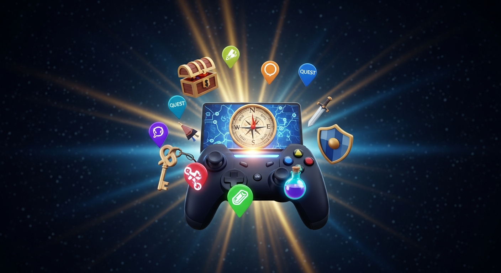

# Getting Started

> **New Haven Gaming Bot** is a fully custom Discord bot built exclusively for the New Haven Gaming server. It covers economy, pets, fun, moderation, and automatic server tracking — all in one place.

---

## Ping Roles

The server has three opt-in ping roles. You can toggle each one yourself by clicking the button on any relevant post — no need to ask a mod.

| Role | What it's for | How to get it |
|---|---|---|
| **Updates** | Server updates, rule changes, important news | Click 🔔 Get Update Pings on any update post |
| **Announcements** | General announcements and events | Click 🔔 Get Announcement Pings on any announcement |
| **Bot Updates** | New bot features, changes, and fixes | Click 🔔 Get Bot Update Pings on any bot update post |

Clicking the button again removes the role. It works as a toggle — you're always in control.

---

## Economy System

The economy system revolves around a server coin currency. Here's how it works at a high level.

### Earning Coins

There are several reliable ways to earn coins every day:

- **`/daily`** — Your main income source. Claim every 24 hours. Maintaining a streak rewards bonus coins — the longer you keep it going, the more you earn.
- **`/weekly`** — A larger payout once a week.
- **`/monthly`** — The biggest passive reward, claimable once a month.
- **`/work`** — Work a shift for a steady payout with a short cooldown.
- **`/beg`** — Small random amount, no cooldown.
- **`/crime`** — Higher risk, higher reward. You can lose coins if caught.

### Gathering & Selling

Three gathering activities produce items you can sell:

- **`/fish`** — Catches fish of varying rarity (Common, Rare, Legendary, etc.)
- **`/hunt`** — Hunts animals in the woods
- **`/mine`** — Mines ores and gems

Once you have items, sell them with `/sell <item>` or dump everything at once with `/sellall`. Items sit in your `/inventory` until you sell them.

### Gambling & Games

Several commands let you wager coins for a chance at bigger rewards:

| Command | Risk level |
|---|---|
| `/cointoss` | 50/50 |
| `/gamble` | Random multiplier |
| `/highlow` | Low risk, jackpot on exact match |
| `/slots` | Slot machine odds |
| `/blackjack` | Skill-based card game |
| `/cockfight` | 50/50 or challenge a member |
| `/horse` | Pick a horse, higher odds = bigger payout |
| `/bankrob` | Multiplayer heist — crew shares the reward |
| `/poker` | Multiplayer Texas Hold'em |

### Spending Coins

- **`/shop`** — Browse what's available to buy on the server
- **`/buy <item> [channel-name]`** — Purchase an item; it goes into your `/inventory`. When buying a **Custom VC**, you can set the channel name right in the command
- **`/give <user> <amount>`** — Send coins directly to another member
- **`/giveitem <user> <item>`** — Give an inventory item to someone

### Your Wallet & Bank

Coins are split between two places:

- **Wallet** — coins here are at risk from `/rob`. Shown in `/balance`.
- **Bank** — completely safe. Nobody can steal from your bank.

Use `/deposit <amount>` to move coins into your bank and `/withdraw <amount>` to pull them back out. The `/balance` command shows both values and a combined total.

### Robbery & Shop Items

Members can rob each other's **wallets** using `/rob`. To protect yourself, buy items from the shop:

| Item | Price | What it does |
|---|---|---|
| **Rob Shield** | 🪙 500 | Automatically blocks the next robbery attempt against you. Consumed when triggered. Shows on `/balance`. |
| **Lockpick** | 🪙 600 | Use `/rob lockpick:true` to bypass a target's Rob Shield. Consumed on use. |
| **Spy** | 🪙 250 | Use `/spy <user>` to secretly check someone's wallet. Only you see the result. Consumed on use. |

> **Bank coins are always safe.** Only wallet coins can be stolen. Deposit your coins when you're not actively using them.

Getting caught robbing someone sends you to **jail** for 15–30 minutes — while jailed, all earning and gambling commands are locked.

View the robbery leaderboard with `/roblb` to see the server's top robbers and most robbed members.

### Checking Your Balance

- **`/balance`** — Your wallet, bank, and total — plus a shield indicator if your Rob Shield is active
- **`/leaderboard`** — See who has the most coins on the server
- **`/roblb`** — See the top robbers and most robbed members

---

## Pet System

You can adopt one companion pet at a time. Pets have stats that change based on how well you care for them.

### Adopting a Pet
Browse available pets with `/pet shop` and adopt one with `/pet adopt`. Each pet costs a set number of coins.

### Caring for Your Pet
- **`/pet feed`** — Keep your pet's hunger up. Available every **4 hours**.
- **`/pet play`** — Boost your pet's happiness. Available every **6 hours**.

Neglecting your pet will lower its mood over time. Check its current state anytime with `/pet status`.

### Other Actions
- **`/pet name <name>`** — Give your pet a custom name
- **`/pet release`** — Release your pet for a partial coin refund

---

## Custom Voice Channels

Members can purchase a **Custom VC** from the server shop for **25,000 coins**. No previous shop tier is required — it can be bought at any time.

### What You Get

- A permanent voice channel that stays even when it's empty
- Full control over the channel name, size, bitrate, and privacy
- A personal guestlist and blacklist
- VC-only mute and ban tools (no server impact)

### Setting Up Your VC

1. Buy the **Custom VC** item with `/buy Custom VC [channel-name]`
2. Your channel is created immediately — you own it
3. Manage everything with `/vc help` to see all available commands

### Key Commands

| Command | What it does |
|---|---|
| `/vc name <name>` | Rename your VC |
| `/vc privacy <public/private>` | Open to everyone or restrict to your guestlist |
| `/vc add <user>` | Add someone to your guestlist |
| `/vc blacklist <user>` | Block someone from joining |
| `/vc transfer <user>` | Transfer ownership to another member |

See the [Custom Voice Channels](custom-vc.md) page for the full command reference.

---

## Tracking Systems

The bot automatically tracks several stats for every member — no setup needed.

### Voice Time
Time spent in voice channels is tracked in the background. Accumulating enough VC time earns you voice levels. Check your stats with `/voicetime check` and see the top members with `/voicetime leaderboard`.

### Message Count
Every message you send in the server is counted. View your total with `/messages check` and compare with the server with `/messages leaderboard`.

### Invites
When a new member joins using your invite link, you get credit. See your invite count with `/invites check` and the top inviters with `/invites leaderboard`.

### Reputation
Once per day you can give a reputation point to any member with `/rep give <user>`. Check anyone's rep score with `/rep check`. Rep is a way to recognise helpful or positive members.

### Profile
`/profile [user]` pulls all tracking stats together into one embed — coins, rep, VC time, voice level, messages sent, and invite count — for a full picture of any member's activity on the server.

---

## Starboard

When a message receives enough ⭐ reactions, it gets automatically reposted in the starboard channel. The star threshold and target channel are configured by staff using `/starboard set`.
