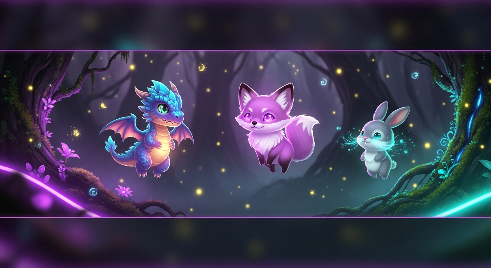

# 🐾 Pet Commands

Adopt and care for a companion pet. All pet interactions live under the `/pet` command.

---

## Getting a Pet

| Command | Description |
|---|---|
| `/pet shop` | Browse the pet shop — see all available companions and their prices |
| `/pet adopt <pet>` | Adopt a pet from the shop using coins |

You can only own one pet at a time. If you want a different pet, you need to `/pet release` your current one first.

---

## Caring for Your Pet

| Command | Cooldown | Description |
|---|---|---|
| `/pet feed` | 4 hours | Feed your pet to maintain their hunger level |
| `/pet play` | 6 hours | Spend time with your pet to boost their happiness |

> Neglecting your pet — not feeding or playing with them regularly — will lower their mood over time. Keep an eye on their stats.

---

## Managing Your Pet

| Command | Description |
|---|---|
| `/pet status` | View your pet's current stats: hunger, happiness, mood, and level |
| `/pet name <name>` | Give your pet a custom name (max 32 characters) |
| `/pet release` | Release your pet back into the wild for a partial coin refund |
